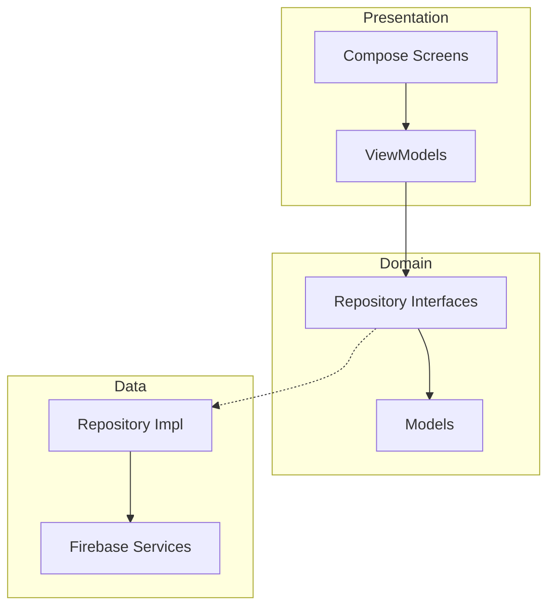
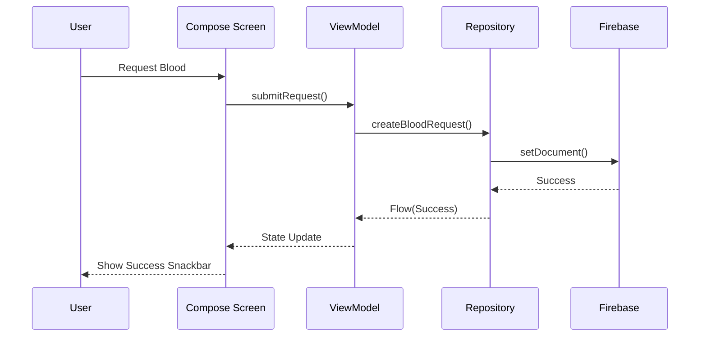
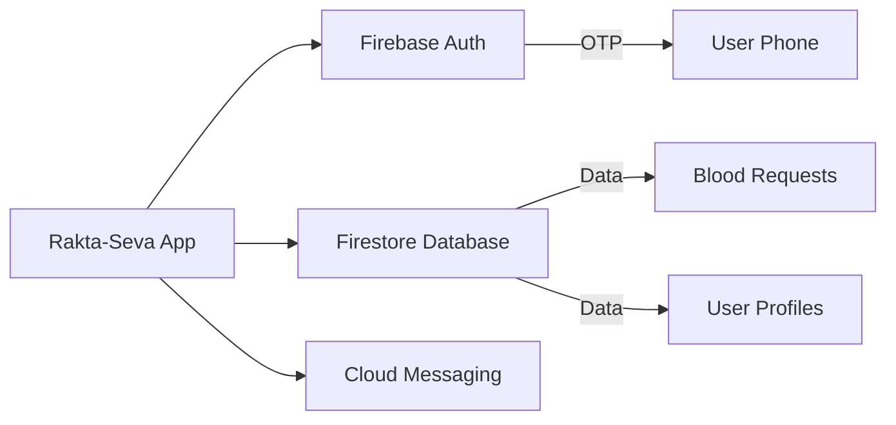
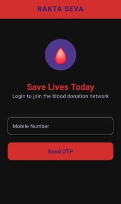
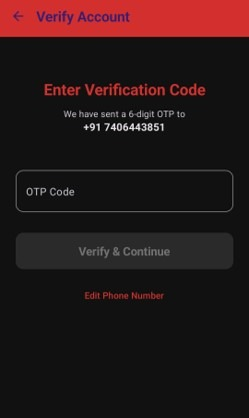
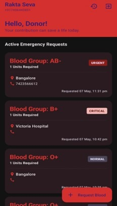
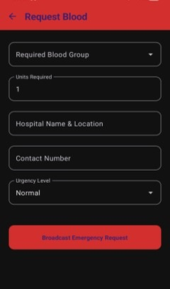

# RAKTA-SEVA CONNECT

**Real-time emergency blood donor Android application.**

Rakta-Seva Connect is a life-saving platform designed to bridge the gap between blood donors and recipients in real-time. Built with modern Android technologies, it provides a seamless experience for posting emergency blood requests and connecting with nearby donors.

## Features
- **OTP Authentication**: Secure login using Firebase Phone Authentication.
- **Blood Request Posting**: Quickly post emergency blood requirements with urgency levels (Normal, Urgent, Critical).
- **Dashboard**: Real-time view of active blood requests in the vicinity.
- **Firebase Firestore Integration**: Real-time synchronization of requests and user profiles.
- **AI Assistant**: Built-in GenAI assistant to help users with blood donation eligibility and general queries.

## Technologies Used
- **Kotlin**: Core programming language.
- **Jetpack Compose**: Modern toolkit for building native UI.
- **Firebase Authentication**: For secure phone-based login.
- **Firebase Firestore**: Real-time NoSQL database for requests and user data.
- **Hilt (Dagger)**: Dependency injection for clean and modular code.
- **Coroutines & Flow**: For asynchronous operations and reactive data streams.
- **MVVM Architecture**: Ensures separation of concerns and testability.

## Architecture
The project follows the **MVVM (Model-View-ViewModel)** architecture pattern, ensuring a clean separation between the UI and business logic.



## Workflow Diagram



## Firebase Interaction Flow



## Screenshots

### Login Screen


### OTP Verification


### Dashboard


### Request Blood Screen


## Installation Steps
1. **Clone the repository**:
   ```bash
   git clone https://github.com/04Sanjanaa/Rakta-Seva-Connect.git
   ```
2. **Open in Android Studio**:
   Import the project as a Gradle project.
3. **Add google-services.json**:
   Download your `google-services.json` from Firebase Console and place it in the `app/` directory.
4. **Sync Gradle**:
   Wait for the project to download all dependencies and sync.
5. **Run app**:
   Connect a physical device or use an emulator and click 'Run'.

## Firebase Setup
1. **Enable Phone Authentication**:
   In Firebase Console -> Authentication -> Sign-in method -> Enable Phone.
2. **Add SHA-1 Fingerprint**:
   Add your debug and release SHA-1 fingerprints to the Firebase Project Settings.
3. **Firestore Setup**:
   Enable Cloud Firestore in Test Mode (or production with proper rules) and create the following collections:
   - `users`
   - `blood_requests`

## Future Enhancements
- **Maps Integration**: Real-time location tracking of donors.
- **Push Notifications**: Instant alerts for nearby emergency requests.
- **AI-Powered Matching**: Advanced algorithms to find the most suitable donors.

## Author
**SANJANAA P**

---
*Developed for professional project evaluation and portfolio showcase.*
